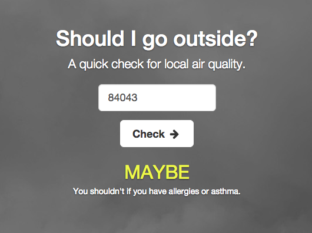

A simple API and frontend that tells you if you should go outside during days with questionable air quality. Pulls local AQI (Air Quality Index) data from [AirNow's](http://www.airnow.gov/) API.

Backend API is written in ruby ([grape](https://github.com/ruby-grape/grape)). Static frontend uses html/jquery. 

## Setup 

First, sign up for an API key at AirNow.

	# clone repo
	export AIRNOW_API_KEY=YOUR_KEY_GOES_HERE
	mux
	open http://localhost:8000

List API routes

	rake routes
